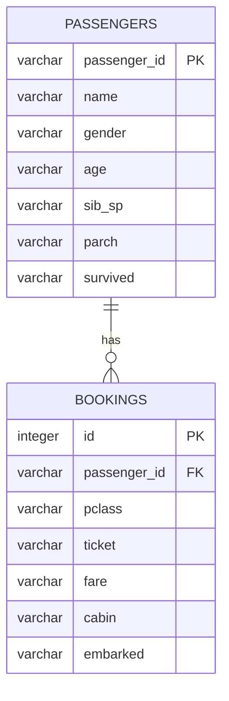

# Titanic ERD

Mermaid `erDiagram`은 속성·관계 라벨의 **따옴표·괄호·슬래시** 등에서 파싱 오류가 납니다. 필드 설명은 아래 표를 참고하세요.

## 관계

| 관계 | 설명 |
|------|------|
| PASSENGERS → BOOKINGS | 1:N (`bookings.passenger_id` → `passengers.passenger_id`) |

## 필드 설명

| 테이블 | 필드 | 설명 |
|--------|------|------|
| PASSENGERS | passenger_id | PK, Kaggle 원본 PassengerId (varchar) |
| PASSENGERS | name | 승객 이름 |
| PASSENGERS | gender | 성별 (`male` / `female`) |
| PASSENGERS | age | 나이 (문자열) |
| PASSENGERS | sib_sp | 형제자매·배우자 수 (문자열) |
| PASSENGERS | parch | 부모·자녀 수 (문자열) |
| PASSENGERS | survived | 생존 여부 (`"0"` / `"1"`, NULL = test set) |
| BOOKINGS | id | PK, auto-increment (integer) |
| BOOKINGS | passenger_id | FK → `passengers.passenger_id` |
| BOOKINGS | pclass | 티켓 등급 (`"1"` / `"2"` / `"3"`) |
| BOOKINGS | ticket | 티켓 번호 |
| BOOKINGS | fare | 운임 요금 (문자열) |
| BOOKINGS | cabin | 객실 번호 |
| BOOKINGS | embarked | 승선항 (`C` / `Q` / `S`) |
